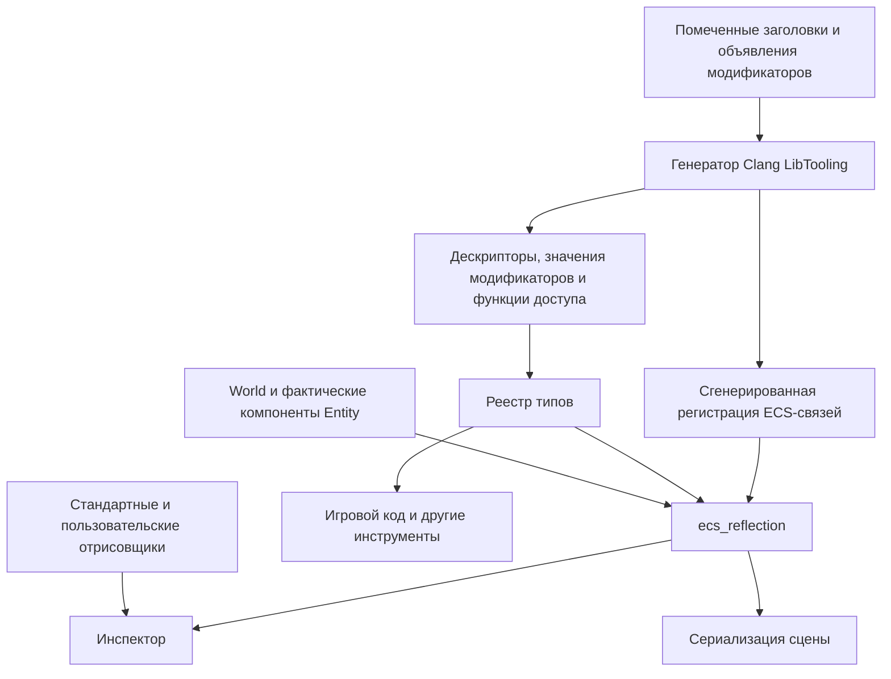

**Система рефлексии Continuum автоматически подготавливает метаданные C++-типов при сборке.** Разработчик помечает классы, структуры, поля и методы через `OBJECT`, `FIELD` и `FUNCTION`. Генератор на Clang LibTooling создаёт описания типов, функции доступа и регистрации. Инспектор, сериализация, игровые системы и другие инструменты используют общий API рефлексии.

Для разработчика наблюдаемый результат такой: после добавления помеченного компонента и пересборки его поля доступны редактору без изменения `InspectorPanel`. Отображение и редактирование настраиваются модификаторами меток. Когда требуется собственный интерфейс, разработчик регистрирует отрисовщик соответствующего типа.

Документ описывает целевую архитектуру и принятые ограничения. Наличие возможности в документе не означает, что она уже реализована. Расширяемые модификаторы, их семантический анализ и поддержка подсказок внутри меток внедряются отдельными этапами.

---

**Архитектура разделяет генерацию, описание данных и их использование.**

| Часть | Ответственность | Основные зависимости |
|---|---|---|
| ECS | Сущности, хранилища, состав компонентов и безопасное посещение | Стандартная библиотека C++ |
| `ContinuumReflection` | Дескрипторы, модификаторы, реестр, доступ к значениям и вызов методов | Стандартная библиотека C++ |
| `ContinuumReflectionGenerator` | Анализ заголовков, диагностика и генерация C++ | LLVM/Clang LibTooling |
| `ecs_reflection` | Связь хранилищ ECS с дескрипторами и типизированными операциями | ECS и ядро рефлексии |
| Интеграция сцены | Сериализация, ссылки между сущностями и проверки сцены | Рефлексия, ECS и `ecs_reflection` |
| Интеграция редактора | Отрисовщики, редактирование и история изменений | Рефлексия, интеграция сцены и ImGui |
| Код проекта | Пользовательские типы, модификаторы и потребители метаданных | Публичные API движка |

ECS и ядро рефлексии не зависят от API друг друга. Их взаимодействие выполняет отдельный слой `ecs_reflection`.

В `World` не хранится `TypeRegistry`, а в `IStash` и `Stash<T>` — `TypeDescriptor`. Модификаторы рефлексии интерпретируются соответствующими потребителями и слоями интеграции.

Ядро рефлексии доступно без ECS, SDL и редактора. Генератор является отдельным исполняемым инструментом. LLVM и Clang не становятся runtime-зависимостями приложения, использующего сгенерированные метаданные.

Рефлексия предоставляет сведения и операции. Владение компонентами остаётся у `World`. Слой интеграции предоставляет временные представления компонентов и не сохраняет их адреса между посещениями.

---

**Описание типа существует отдельно от экземпляров этого типа.**

| Сущность | Назначение |
|---|---|
| `TypeDescriptor` | Идентичность типа, базовое название, категория, модификаторы, поля, методы и поддерживаемые операции |
| `FieldDescriptor` | Идентичность поля внутри владельца, базовое название, тип, C++-квалификаторы, модификаторы и функции доступа |
| `FunctionDescriptor` | Идентичность метода, владелец, сигнатура, модификаторы и обёртка вызова |
| `EnumDescriptor` | Тип хранения перечисления, имена и значения вариантов |
| `Modifiers` | Неизменяемый набор типизированных модификаторов одного объявления |
| `TypeRegistry` | Поиск типов и проверенные связи между описаниями |
| `ObjectView` | Временное представление конкретного экземпляра с описанием его типа |
| `OwnedValue` | Владение значением, например результатом отражённого вызова |

Поддержка методов, перечислений и принадлежащих рефлексии результатов развивается отдельно от базового доступа к полям.

Категории типов определяют способ общей обработки: логическое значение, целое число, вещественное число, строка, перечисление, составной тип или специализированный внешний тип.

Для каждого пользовательского класса не требуется добавлять новую категорию. Его устройство выражается собственным `TypeDescriptor`.

Операции, связывающие тип с хранилищем ECS, принадлежат `ecs_reflection`. Они не являются частью общего `TypeDescriptor`.

---

**Система различает идентичность C++-типа, постоянные ключи и локальные индексы.**

| Идентификатор | Назначение |
|---|---|
| Native type key | Связывает настоящий C++-тип с описанием внутри процесса; первоначально используется `std::type_index` |
| `TypeId` | Возможный компактный идентификатор внутри зафиксированного реестра |
| `TypeKey` | Постоянный строковый ключ типа для сохранённых данных |
| `FieldKey` | Постоянный ключ поля внутри содержащего типа |
| `FunctionId` | Однозначно выбирает метод вместе с его сигнатурой |
| `ComponentID` | Индексирует хранилища конкретного `World` |
| Тип модификатора | Определяет, какие метаданные запрашиваются из `Modifiers` |

По умолчанию `TypeKey` выводится из полного C++-имени, а `FieldKey` — из имени члена. Модификатор `Key` позволяет явно сохранить прежнюю идентичность после переименования.

`name` в дескрипторе хранит базовое имя. Для типа это короткое имя без пространства имён, для поля — исходное имя члена. Пользовательская подпись хранится в `DisplayName`.

Отображаемые подписи не участвуют в идентификации. Изменение `DisplayName` не меняет ключи сериализации, цель редактирования или идентификаторы элементов интерфейса.

Адреса, значения `std::type_index`, порядковые номера полей и машинные пути не записываются в сцены как постоянные идентификаторы.

Псевдонимы одного C++-типа используют одну идентичность. Квалификаторы и ссылки описываются отдельно от идентичности основного типа.

Связь между `ComponentID` и отражённым типом существует только в контексте конкретного мира. Одинаковые `ComponentID` в разных мирах могут обозначать разные типы.

---

**Метки имеют однозначную область применения.**

| Метка | К чему относится | Результат |
|---|---|---|
| `OBJECT` | Полное определение именованного класса или структуры | Создаёт описание типа |
| `FIELD` | Одно непосредственно объявленное нестатическое поле | Добавляет поле в описание |
| `FUNCTION` | Одно объявление метода | Добавляет описание и обёртку вызова метода |

Метка располагается непосредственно перед соответствующим объявлением. Для метода с отдельным определением помечается объявление внутри типа.

Метки объявляются в `reflection/markers.h` и доступны пользователю через подключение `engine.h`.

Публичный заголовок меток содержит метки, объявления встроенных модификаторов и минимальные средства их проверки во время компиляции. Он не подключает реестр типов, дескрипторы, `ObjectView`, runtime-хранилище `Modifiers` или инструменты редактора.

Для работы с метаданными пользователь явно подключает соответствующие заголовки рефлексии. Собственные модификаторы объявляются в заголовках проекта, доступных в месте применения метки.

Учитываются активные ветки препроцессора. Неоднозначная привязка, неподдерживаемое объявление и некорректные аргументы метки вызывают ошибку с указанием файла и строки.

**Поддержка закрытых членов основана на обычных правилах C++.**

`FIELD` и `FUNCTION` предоставляют через `friend` доступ заранее объявленному шаблону генерируемого помощника `TypeAccess`. Помощник выполняет обращения к закрытым членам внутри своего разрешённого контекста.

Минимальное предварительное объявление помощника находится в служебном заголовке, подключаемом из `markers.h`.

Добавление проверки аргументов меток сохраняет эти `friend`-объявления. Доступ основывается на предусмотренной C++ дружбе с шаблонами и их специализациями. [Правила template friendship](https://eel.is/c++draft/temp.friend).

Дополнительный `GENERATED_BODY` и обязательное включение ещё не созданного заголовка не требуются. Наличие `OBJECT` само по себе не разрешает создание объекта через закрытый конструктор.

---

**Каждый модификатор является отдельным C++-типом со своими данными.**

Тип модификатора одновременно определяет его идентичность и устройство значения.

Например:

- `DisplayName` содержит строковую подпись;
- `Step` содержит числовой параметр редактирования;
- пользовательский модификатор может содержать несколько связанных значений;
- `ReadOnly` и `ShowInInspector` выражают правило самим фактом присутствия.

Модификаторы без данных тоже имеют собственные типы. Отдельная битовая маска для них не является публичной моделью метаданных.

В аргументах метки передаются значения модификаторов. Запись `DisplayName("Camera")` должна иметь обычный C++-смысл создания значения. Пустые модификаторы также должны передаваться в форме допустимого C++-выражения.

Типы модификаторов остаются доступными для типизированных запросов. Возможные сокращения синтаксиса не должны скрывать имя типа или требовать отдельного строкового языка метаданных.

**Дескрипторы используют общий класс `Modifiers`.**

Одинаковая модель применяется к типам, полям и, при реализации соответствующих дескрипторов, методам.

| Операция | Контракт |
|---|---|
| `has<M>()` | Возвращает наличие модификатора типа `M` |
| `tryGet<M>()` | Возвращает `const M*` либо `nullptr`, если модификатор отсутствует |

Получение модификатора не копирует его данные. Вызывающая сторона получает неизменяемое представление сохранённого значения.

Публичный API не требует передавать выходной буфер через `void*`. Соответствие ключа типу возвращаемого значения обеспечивает типизированная обёртка хранилища.

Внутренняя реализация может скрывать конкретные типы за общей записью, но проверка идентичности выполняется до приведения адреса. Для идентификации внутри процесса первоначально подходит `std::type_index`.

Закрытый `enum` со списком всех модификаторов не используется: пользовательские расширения не должны требовать изменения перечисления движка.

На одном дескрипторе допускается не более одного экземпляра каждого типа модификатора. Повтор вызывает диагностику. Порядок записи не используется для неявного выбора последнего значения.

Модификаторы поля и модификаторы его типа являются разными наборами. Они не объединяются автоматически. Правила совместного применения определяются смыслом конкретного модификатора.

C++-свойства объявления — `const`, `volatile`, доступность члена, параметры ссылок и другие квалификаторы — описываются отдельно. Они выводятся из AST и не заменяются пользовательскими модификаторами.

---

**Пользовательские модификаторы поддерживаются через общий контракт расширения.**

Пользователь объявляет собственный тип данных и указывает, что он является модификатором, а также допустимые места его применения. Конкретная форма этого контракта определяется публичными средствами объявления модификаторов.

Генератор проверяет соответствие общему контракту. Добавление пользовательского модификатора не требует расширения списка разрешённых строковых имён в генераторе.

Сам тип модификатора не обязан быть помечен `OBJECT`: хранение метаданных и отражение полей их собственного типа — независимые возможности.

Генератор отвечает за корректное описание и сохранение значения. Значение модификатора интерпретирует его потребитель:

- инспектор применяет настройки отображения;
- сериализатор использует правила сохранения;
- слой `ecs_reflection` обрабатывает `Component`;
- пользовательский drawer читает модификаторы своего проекта;
- другие системы могут определять собственный смысл метаданных.

Корректный пользовательский модификатор может храниться в дескрипторе, даже если стандартный инспектор не знает его назначения.

Первоначально поддерживаются значения, пригодные для создания во время компиляции: числа, перечисления, строки на основе литералов и составные значения из поддерживаемых данных.

Зависимость от состояния игры, открытые ресурсы и указатели на временные объекты не входят в этот контракт.

Возможность constexpr-инициализации является необходимым условием, но сама по себе не гарантирует поддержку любого выражения генератором. Поддерживаемые формы инициализации расширяются явно. Неподдерживаемая форма вызывает диагностику.

---

**Значения модификаторов имеют явное время жизни.**

Генератор создаёт именованные неизменяемые объекты модификаторов в сгенерированном C++. Эти объекты имеют статическое время жизни и принадлежат статически подключённому модулю.

`Modifiers` предоставляет доступ к этим объектам. Копирование или размещение дескриптора в `TypeRegistry` не копирует сами значения модификаторов.

Все вложенные ссылки и представления внутри модификатора также должны ссылаться на достаточно долгоживущие неизменяемые данные. Например, строковое представление может ссылаться на строковый литерал или сгенерированное статическое хранилище.

В runtime-описания не попадают адреса объектов Clang, строки временной модели генератора или указатели на промежуточные значения инициализации.

Фиксация `TypeRegistry` не меняет владельца заимствованных данных модификаторов.

Динамическая выгрузка модулей не поддерживается первой версией. Она потребует отдельного протокола для дескрипторов, значений модификаторов, функций доступа и всех использующих их ссылок.

---

**Встроенные модификаторы используют тот же механизм, что и пользовательские.**

| Модификатор | Область применения | Значение |
|---|---|---|
| `Component` | `OBJECT` | Запрашивает генерацию связи с ECS во внешнем слое `ecs_reflection` |
| `Serialize` | `OBJECT`, `FIELD` | Определяет участие типа или поля в стандартном сохранении |
| `ShowInInspector` | `FIELD` | Разрешает стандартному инспектору показывать поле |
| `ReadOnly` | `FIELD` | Запрещает редактирование поля через интерфейс редактора |
| `Key` | Тип или поле | Задаёт постоянный ключ |
| `DisplayName` | Тип, поле или метод | Задаёт пользовательскую подпись |
| `Unit` | Подходящее поле | Описывает единицу хранения значения |
| `Min`, `Max` | Подходящее числовое поле | Описывают числовые границы |
| `Step` | Подходящее числовое поле | Настраивает шаг интерактивного изменения |

Этот набор не является закрытым списком возможностей.

Показ, сохранение и доступность изменения независимы. Скрытое поле может сохраняться. Отображаемое поле может не участвовать в сохранении.

`ReadOnly` задаёт политику редактора. Настоящий C++ `const` ограничивает сам доступ к данным.

`Key` используется при формировании идентичности дескриптора. После фиксации реестра ключ не изменяется.

`DisplayName` является единственным источником пользовательского переопределения подписи. Дескрипторное `name` сохраняет базовое имя.

Правило выбора подписи:

1. Для значения поля используется его `DisplayName`, а при отсутствии — `FieldDescriptor::name`.
2. Для корневого значения используется `DisplayName` типа, а при отсутствии — `TypeDescriptor::name`.

Заголовки секций и `DrawContext::label()` используют одно и то же правило.

---

**Правила числового редактирования описываются метаданными и применяются потребителями.**

Стандартные числовые drawers читают модификаторы поля и используют их при построении интерфейса и принятии нового значения.

Отсутствующий параметр отличается от нулевого значения. Например, отсутствие `Min` не означает нижнюю границу, равную нулю.

Значения границ и шага должны соответствовать настоящему типу поля. Проверки не должны незаметно сужать диапазон целого типа или терять значимую точность.

До реализации числовых модификаторов фиксируются:

- включительность границ;
- требования к конечности значений;
- поведение при вводе значения вне диапазона;
- точная семантика `Step`;
- согласованность параметров, включая нижнюю и верхнюю границы.

Настройка скорости перетаскивания и требование кратности значения определённому шагу являются разными правилами. Одно не подразумевает другое автоматически.

Единица хранения отделяется от единицы отображения. Для угла, хранящегося в радианах, интерфейс может показывать градусы. Преобразование выполняется на границе отображения и ввода.

Числовые ограничения должны иметь явно определённые единицы. Преобразование отображения не меняет смысл сохраняемого значения. Конкретный способ декларативного выбора единицы отображения вводится при реализации модификаторов единиц.

**Связи между полями требуют отдельного декларативного правила.**

Для `Camera` условие `nearPlane < farPlane` нельзя выразить двумя независимыми постоянными границами.

Целевой механизм должен позволять описать отношение между полями. Генератор разрешает ссылку на поле и проверяет совместимость типов. Во время редактирования правило проверяется при изменении любой стороны отношения.

При вложенном поле контекст проверки должен позволять обращаться к содержащему его объекту. Этот объект может отличаться от корневого ECS-компонента.

Точный синтаксис отношений и API их проверки определяются отдельным этапом. Универсальный вычислитель произвольных выражений для этого не требуется.

`CameraDrawer` не является обязательной частью выбранного решения. Правила камеры задаются модификаторами и применяются общим механизмом числового редактирования.

`EditorSession` не содержит специальных проверок полей `Camera`.

Метаданные сами по себе не перехватывают обычные присваивания в C++. Потребители обязаны применять соответствующие правила. Переиспользуемые проверки данных не должны зависеть от ImGui, чтобы их могли вызывать загрузка и другие системы.

---

**Поддержка IDE опирается на настоящие C++-объявления модификаторов.**

Модификаторы должны быть видимы языковому серверу как типы, конструкторы и другие обычные символы C++.

Документирующие комментарии располагаются непосредственно над соответствующими объявлениями. Описание не дублируется вручную в отдельном списке подсказок.

Расширение Microsoft C/C++ для VS Code предоставляет дополнение имён и всплывающую информацию. Оно также поддерживает показ документирующих комментариев Doxygen. [Возможности расширения](https://code.visualstudio.com/docs/languages/cpp), [поддержка Doxygen](https://devblogs.microsoft.com/cppblog/visual-studio-code-c-extension-july-2020-update-doxygen-comments-and-logpoints/).

Для этого аргументы меток должны участвовать в семантическом анализе C++. Полное удаление `__VA_ARGS__` при раскрытии макроса не является достаточной основой для надёжных подсказок и перехода к объявлению.

Целевая форма раскрытия метки использует аргументы в проверке времени компиляции, например через служебную проверку внутри `static_assert`.

Такое раскрытие должно:

- быть допустимым в поддерживаемых местах применения метки;
- сохранять `friend`-доступ у `FIELD` и `FUNCTION`;
- не добавлять поля в экземпляр пользовательского типа;
- не выполнять действий при запуске;
- позволять Clang связать аргументы с их настоящими C++-типами;
- не мешать привязке метки к пользовательскому объявлению.

Имена модификаторов должны быть доступны в месте применения через квалифицированное имя или обычные правила `using`. Пространство имён служебной функции проверки не переносит туда имена её аргументов.

Базовый путь не требует собственного расширения VS Code. Проверка completion, hover и перехода к объявлению внутри выбранного раскрытия макроса является отдельным критерием готовности.

Обычное дополнение C++ не гарантирует список, строго отфильтрованный по допустимым модификаторам конкретной метки. Если потребуется такое поведение, оно реализуется отдельным инструментом редактора. VS Code предоставляет API для completion и hover. [Программные языковые возможности VS Code](https://code.visualstudio.com/api/language-extensions/programmatic-language-features).

---

**Поддержка конструкций C++ расширяется поэтапно.**

Полноценный анализ Clang используется с самого начала. Объём runtime-возможностей развивается независимо от выбора инструмента анализа.

Базовый срез включает именованные нешаблонные классы и структуры, отражённые поля, вложенные отражаемые значения и базовые типы `bool`, `int`, `float`, `double`.

Дальнейшее развитие включает:

| Возможность | Контракт |
|---|---|
| Другие целые типы | Сохраняются настоящий тип, знаковость и диапазон |
| `std::string` | Встроенное описание и специализированные операции |
| Перечисления | Имена, значения и настоящий тип хранения |
| Внешние типы, включая выбранные математические типы | Явные описания и адаптеры движка |
| Доступные именованные вложенные типы | Корректные владение и разрешение имени |
| Методы и перегрузки | Описание конкретной сигнатуры и типизированный вызов |
| Поля `const` | Чтение; обычная загрузка в такое поле запрещена |

Отражение наследования, шаблонов пользователя, указателей, полей-ссылок, bit-fields, unions и произвольных контейнеров требует отдельных контрактов.

Конструкторы, деструкторы, операторы, шаблонные и вариативные методы не входят в начальный набор вызовов.

Непомеченный C++-код сохраняет обычные возможности языка. Неподдерживаемая помеченная конструкция вызывает диагностику.

Для перечислений, используемых отражаемыми полями, необходимые описания собираются в пределах владения модулем. Для сторонних библиотек применяется внешняя регистрация.

---

**Генератор выполняет анализ отдельно для каждого модуля и контекста сборки.**

Последовательность работы:

1. Получить список заголовков, принадлежащих модулю.
2. Подготовить единицу трансляции для анализа.
3. Получить параметры компиляции целевого модуля.
4. Зафиксировать метки через события препроцессора.
5. Исследовать пользовательские объявления и семантически доступные аргументы меток через AST.
6. Разрешить типы модификаторов и проверить их применение.
7. Построить собственную проверенную модель данных.
8. Сгенерировать дескрипторы, значения модификаторов, функции доступа и регистрации.
9. Для типов с `Component` дополнительно сгенерировать регистрацию ECS-связей.

LibTooling использует контекст компиляции для правильного анализа файлов. Учитываются include-пути, определения препроцессора, стандарт языка, платформа, SDK и стандартная библиотека. [Документация LibTooling](https://clang.llvm.org/docs/LibTooling.html).

События препроцессора определяют расположение меток, но не заменяют семантический анализ аргументов.

Привязка метки учитывает положение, владельца объявления и служебные декларации, добавленные раскрытием макроса. Сопоставления только по номеру следующей строки недостаточно.

После анализа промежуточная модель владеет своими строками и данными. Она не сохраняет ссылки на уничтожаемые объекты Clang.

**Генерация пользовательских модификаторов сохраняет C++-семантику.**

Генератор должен получить настоящий тип модификатора и поддерживаемое представление его инициализации. В сгенерированном коде создаётся объект этого типа.

Перенос аргументов учитывает области видимости, разрешённые объявления и зависимости от заголовков. Простого копирования исходного текста с короткими именами может быть недостаточно.

Строковые данные корректно экранируются. Типизированная инициализация не заменяется сохранением сырых байтов объекта.

Генератор не обещает восстановить произвольный C++-объект из AST. Если инициализацию нельзя корректно воспроизвести в поддерживаемой форме, сборка завершается диагностикой.

Встроенные модификаторы с системным смыслом, например `Component`, могут влиять на генерацию дополнительных операций. Хранение обычного пользовательского модификатора не требует отдельной ветки по его имени.

Диагностика различает:

- неизвестное C++-имя;
- тип, не соответствующий контракту модификатора;
- недопустимую область применения;
- повтор одного типа модификатора;
- некорректные или несовместимые значения;
- неподдерживаемую форму инициализации;
- неоднозначную привязку метки.

---

**Каждый модуль владеет своими результатами генерации.**

Каждый отражаемый заголовок принадлежит одному модулю. Заголовки зависимостей используются для разрешения типов, но их описания повторно не генерируются.

Несколько помеченных типов в одном заголовке обрабатываются одним проходом соответствующего модуля. Разработчик не создаёт отдельные targets и команды для каждого класса.

В принятой модульной схеме результаты разделяются по ответственности:

- общие описания типов, модификаторы и функции доступа;
- дополнительный код интеграции ECS;
- подготовленные для приложения вызовы регистраторов модулей.

Общие описания не содержат операций над хранилищами ECS.

Для типа с модификатором `Component` дополнительная часть регистрирует связь во внешнем слое `ecs_reflection`. Она содержит идентичность C++-типа, дескриптор и типизированные функции получения представления компонента.

Регистратор получает дескриптор через `TypeRegistry` по native type key. Обращение к внутренним символам другого сгенерированного файла не требуется.

Результат генерации:

- имеет определённый порядок;
- не содержит случайных идентификаторов и временных отметок;
- использует типизированные операции C++;
- заменяется только при изменении содержимого;
- сопровождается зависимостями от прочитанных файлов.

Ошибка генерации останавливает сборку. Старые результаты не считаются успешным результатом нового анализа.

---

**CMake автоматически собирает генератор и запускает его для подключённых модулей.**

Основной путь использует C++23, Ninja и настроенный для платформы toolchain. Версия LLVM/Clang закрепляется в зависимостях генератора.

При подготовленном окружении обычная сборка приложения должна при необходимости собрать сам генератор, выполнить анализ и скомпилировать результаты. Отдельный ручной запуск генератора после каждого изменения не требуется.

На новом компьютере предварительно необходимы системный компилятор, SDK и инструменты сборки. Получением и сборкой закреплённых зависимостей генератора управляет CMake.

Контекст анализа берётся из compilation database целевого target. CMake предоставляет такой экспорт для Ninja и Makefile generators. Для Visual Studio и Xcode потребуется отдельный путь передачи контекста. [CMake compilation database](https://cmake.org/cmake/help/latest/variable/CMAKE_EXPORT_COMPILE_COMMANDS.html).

| Средство интеграции | Ответственность |
|---|---|
| `continuum_enable_reflection` | Подключает генерацию для модуля и задаёт корни поиска заголовков |
| `continuum_link_modules` | Подключает модули потребителю и учитывает их свойства рефлексии |
| `continuum_finalize_reflection` | Подготавливает вызовы регистрации для собранного состава модулей |

Разработчик объявляет зависимость приложения от модулей. Отдельные компоненты, заголовки внутри настроенных корней и функции регистрации вручную не перечисляются.

Свойства target, включая `CONTINUUM_ECS_REFLECTION_TARGET` и `CONTINUUM_REFLECTION_MODULE_NAME`, передают сведения о сгенерированных частях. Повторное упоминание модуля не должно приводить к повторной регистрации его типов.

Результаты находятся в build-каталоге. Различающиеся конфигурации не записывают несовместимые данные в один выходной файл.

Зависимости генерации учитывают входные заголовки, транзитивно прочитанные файлы, параметры анализа, исполняемый файл и настройки генератора.

Для успешного прохода используется отдельная отметка завершения — stamp. Она обновляется после успешной генерации, даже если содержимое сгенерированного C++ не изменилось. Сгенерированные файлы объявляются артефактами команды сборки. [CMake custom commands](https://cmake.org/cmake/help/latest/command/add_custom_command.html).

Код проекта и его метаданные доступны игре и редактору. Дополнительная часть ECS подключается потребителям отражённых компонентов. Пользовательские drawers находятся в редакторской части.

Первоначально модули подключаются статически. Открытие проекта с другим набором C++-типов требует соответствующей пересборки редактора.

---

**Регистрация имеет явный порядок и завершается до использования рефлексии.**

Последовательность запуска приложения с интеграцией ECS:

1. Зарегистрировать встроенные, внешние и проектные типы.
2. Подготовить их описания, поля, методы и операции.
3. Разрешить ссылки между описаниями.
4. Проверить ключи, дубликаты и обязательные возможности.
5. Зафиксировать реестр типов.
6. Выполнить сгенерированную регистрацию ECS-связей и зафиксировать их набор.
7. Подготовить внешние контексты миров и редакторские регистрации.

Обычный `World` создаётся и работает независимо от рефлексии. Реестр и набор связей передаются внешнему контексту интеграции, а не самому миру.

Вызовы регистраторов подготавливаются сборкой. Регистрация не зависит от случайного порядка выполнения глобальных конструкторов.

После фиксации дескрипторы и набор ECS-связей неизменяемы. Таблица соответствий хранилищ конкретного мира может дополняться при появлении новых хранилищ.

Мир и зарегистрированные связи должны жить дольше использующего их контекста. Дескрипторы должны жить дольше представлений и операций, которые на них ссылаются.

Статические данные модификаторов и сгенерированные функции должны оставаться доступными на протяжении использования дескрипторов.

При уничтожении или замене мира его контекст интеграции уничтожается. Динамическая регистрация после фиксации и выгрузка модулей остаются за пределами первой версии.

---

**ECS перечисляет фактические компоненты, а внешний слой связывает их с рефлексией.**

ECS предоставляет общий API посещения хранилищ компонентов. Он оперирует сущностью, локальным `ComponentID`, интерфейсом `IStash` и native type key.

Путь внутри ECS:

**Entity → проверка жизни и поколения → архетип → сигнатура → ComponentID → IStash.**

Сигнатура содержит только реальные компоненты сущности. `ComponentID` непосредственно индексирует хранилища мира.

Определение состава сущности не требует перебора зарегистрированных отражённых типов, ECS-адаптеров или отрисовщиков.

`ecs_reflection` создаёт отдельный контекст для каждого мира. Контекст хранит таблицу, индексируемую по `ComponentID`. Запись указывает на зарегистрированную связь: дескриптор и типизированные операции доступа.

Перед посещением контекст синхронизирует новые хранилища. Для каждого нового хранилища выполняется поиск связи по native type key. Результат сохраняется в таблице.

Отсутствие связи также запоминается, чтобы не повторять неудачный поиск при каждом посещении. Неотражённые хранилища продолжают работать в ECS.

Таблица не хранит адреса компонентов. Адрес экземпляра получается заново во время посещения.

Полный путь к отражённому значению:

**Entity → фактический ComponentID → IStash → связь в контексте мира → типизированный доступ → ObjectView.**

Функция связи проверяет native type key перед приведением хранилища к `Stash<T>`. Затем получает компонент через типизированный доступ и создаёт его представление.

Контракт посещения обеспечивается ECS:

- отдельно предоставляются чтение и изменение;
- проверяются сущность и её поколение;
- непосредственные структурные изменения и `commit` запрещены до завершения обхода;
- команды могут накапливаться в уже активном отложенном режиме;
- вложенные обходы учитываются;
- защита снимается также при исключении.

Представления компонентов не сохраняются после посещения. Структурные действия интерфейса применяются позднее с повторной проверкой цели.

Посещение с подготовленной таблицей имеет сложность **O(k)**, где `k` — количество компонентов сущности. Подготовка связей новых хранилищ учитывается отдельно. Отрисовка дополнительно зависит от объёма показываемых данных.

`Component` не отменяет требований ECS к типу и не гарантирует возможность автоматического создания. Добавление доступно при наличии корректного способа конструирования и выполняется через обычные операции ECS.

---

**Доступ к значениям сохраняет тип и ограничения изменяемости.**

Функция доступа к полю знает настоящий содержащий тип и конкретный член. Универсальный потребитель вызывает её через описание.

Перед обращением проверяются соответствие экземпляра ожидаемому типу, принадлежность поля и допустимость операции.

Из константного объекта получается константное поле. Вложенный доступ сохраняет ограничения владельца.

`ObjectView` заимствует объект и его дескриптор. Создание представления не копирует объект и не продлевает время жизни объекта или дескриптора.

Представление может создаваться через поиск в реестре или по уже найденному дескриптору. В обоих случаях сохраняется проверка соответствия настоящему C++-типу.

`ReadOnly` является правилом потребителя, а C++-константность — ограничением самого доступа. Наличие изменяемого `ObjectView` не отменяет редакторскую политику.

Создание, копирование, восстановление и уничтожение принадлежащих системе значений выполняются типизированными операциями C++. Для строк и составных объектов не применяется копирование сырых байтов.

Возможность описать объект не обязывает его иметь конструктор по умолчанию или поддерживать копирование.

Обычные отражённые объекты доступны без ECS. Для обращения к компонентам используется внешний слой `ecs_reflection`.

---

**Вызов отражённого метода выбирает конкретную сигнатуру.**

`FunctionDescriptor` содержит владельца, параметры, результат, модификаторы и сведения о C++-свойствах метода, включая `const` и `static`.

Перегрузки имеют разные идентификаторы. Автоматическое разрешение перегрузок и неявные числовые преобразования в первоначальном API не выполняются.

Вызывающая сторона выбирает метод и передаёт значения подходящих типов.

Первоначальный контракт вызова включает параметры по значению и через константную ссылку, результат по значению либо отсутствие результата и синхронное выполнение.

Изменяемые ссылочные параметры, возвращаемые ссылки и указатели требуют отдельного контракта времени жизни.

До выполнения проверяются аргументы и допустимость вызова на данном экземпляре. Результат по значению передаётся как `OwnedValue`.

Исключения метода следуют принятой в проекте политике. Рефлексия не обещает откат его побочных эффектов.

Для вызова на ECS-компоненте представление получателя предоставляется через `ecs_reflection`. Вызов соблюдает время жизни получателя и ограничения посещения мира.

Наличие `FUNCTION` само по себе не создаёт кнопку инспектора или операцию Undo.

---

**Инспектор выбирает отрисовку через отдельный реестр редактора.**

Для выбранной сущности инспектор получает отражённые представления её компонентов через `ecs_reflection`.

Порядок обработки значения:

1. Определить видимость и эффективный режим доступа.
2. Найти drawer для точного C++-типа значения.
3. При наличии drawer передать ему контекст.
4. При отсутствии drawer у составного типа рекурсивно обработать видимые поля.
5. Для неподдерживаемого отображения предоставить понятное состояние.

Базовый набор drawers включает `bool`, `int`, `float` и `double`. Строки, перечисления и дополнительные числовые типы подключаются по мере реализации их описаний.

Стандартные drawers применяют поддерживаемые модификаторы. Пользовательский drawer может читать как встроенные, так и собственные модификаторы.

Реестр drawers не используется для определения состава компонентов сущности.

**Пользовательский drawer является классом.**

Общий интерфейс `IComponentDrawer` предоставляет обычную виртуальную точку входа без знания конкретного типа значения.

Шаблонный `ComponentDrawer<T>` связывает эту точку входа с типизированным `DrawContext<T>`. Пользователь наследуется от него и реализует обычный метод `void draw(DrawContext<T>&)`.

Шаблонный виртуальный метод не требуется.

Регистрация выполняется через `EditorApplication::registerComponentDrawer<Drawer>()`. Тип значения определяется самим drawer. Редактор владеет зарегистрированными экземплярами.

Несмотря на название `ComponentDrawer`, типизированный drawer может рисовать вложенное значение или базовый тип. Регистрация относится к типу значения, а не только к корневому компоненту.

Пользовательский метод отрисовки возвращает `void`. Автору не требуется передавать ошибки через `std::unexpected`. При необходимости он использует выбранный способ диагностики, включая `SDL_Log`.

Это не отменяет обязательных предусловий изменения данных: перед записью необходимо успешно начать операцию редактирования.

---

**Каждое составное значение имеет собственную визуальную секцию.**

Корневой компонент и вложенная структура отображаются внутри отдельной секции с подписью, возможностью сворачивания и визуальным отделением фона или рамки.

Секцию организует общий обход инспектора. Она окружает как пользовательский drawer, так и автоматическое отображение полей.

Drawer не обязан повторно рисовать заголовок своего компонента.

Размер секции определяется содержимым текущего кадра. Она не должна создавать заметное мерцание при первом выборе сущности или постоянную пустую область под полями.

Текущий подход использует таблицу с одной колонкой без прокрутки. Конкретный способ оформления остаётся деталью редактора.

Идентификаторы элементов интерфейса учитывают контекст документа, сущность, тип компонента и полный путь вложенного поля. Отображаемые подписи для этого не используются.

Запрет изменения распространяется внутрь структуры. Он учитывает режим владельца, `ReadOnly`, константность экземпляра и поля. Пользовательская отрисовка соблюдает этот же контракт.

`Transform` сохраняет собственный drawer для удобного группирования положения, поворота и масштаба. Поворот хранится в радианах и показывается в градусах.

Общий обход описаний и выбор отрисовки применимы к значениям вне ECS. Текущий редактирующий `DrawContext` связан с `EditorSession` и компонентной целью; редактирование других владельцев потребует соответствующего контекста операций.

---

**`DrawContext<T>` предоставляет типизированный доступ к данным и текущей операции.**

Контекст различает корневой компонент и рисуемое значение. При отрисовке вложенного поля его типом является тип самого поля, а снимок истории относится ко всему корневому компоненту.

| Метод | Назначение |
|---|---|
| `type()` | Дескриптор рисуемого значения |
| `field()` | Дескриптор текущего поля либо `nullptr` для корневого значения |
| `label()` | Подпись по общему правилу `DisplayName` и базового имени |
| `getValue()` | Доступ к значению через `const T&` |
| `canEdit()` | Проверка эффективного разрешения записи |
| `isEditing()` | Проверка принадлежности активной операции этому контексту |
| `getValueMut()` | Доступ к живому значению через `T&` при выполненных предусловиях |
| `beginEdit()` | Начало операции с сохранением исходного состояния |
| `markChanged()` | Отметка выполненного изменения |
| `endEdit()` | Завершение операции и запись истории |
| `cancelEdit()` | Отмена операции с восстановлением исходного состояния |

Данные типа доступны через `type().modifiers`, данные поля — через модификаторы дескриптора, полученного из `field()`.

Для корневого значения `field()` отсутствует. Drawer не должен предполагать, что всегда рисует поле.

`getValue()` и `getValueMut()` не копируют объект.

`getValueMut()` разрешён только при доступной записи и наличии активной операции, принадлежащей этому контексту. Одна проверка `canEdit()` не заменяет успешный `beginEdit()`.

`canEdit()` описывает режим доступа. Начало операции дополнительно может не состояться, например из-за отсутствия подходящей политики снимка.

Для скалярного виджета допустима локальная копия числа, в которую пишет ImGui. Это деталь drawer, а не требование копировать весь компонент.

Контекст, представления и полученные ссылки не сохраняются между кадрами или после завершения посещения компонента.

---

**Редактирование изменяет живое значение и использует независимые снимки для истории.**

Операция редактирования соответствует одному действию пользователя, например перетаскиванию числового поля.

Её жизненный цикл:

1. Drawer подготавливает предполагаемое изменение и применяет необходимые правила.
2. До первой записи успешно вызывает `beginEdit()`.
3. Система сохраняет исходный снимок всего корневого компонента.
4. Drawer получает изменяемый доступ и записывает новое значение.
5. Drawer вызывает `markChanged()`.
6. Во время продолжения действия изменяется тот же компонент в рамках той же операции.
7. При завершении `endEdit()` сохраняет конечный снимок и создаёт одну запись истории.
8. При отмене `cancelEdit()` восстанавливает исходный снимок.

Повторный `beginEdit()` для той же активной операции не заменяет первоначальный снимок.

Копия всего компонента для каждого промежуточного изменения не требуется. Подготовка временных значений и проверка ограничений выполняются в объёме, необходимом конкретному drawer или механизму правил.

`EditorSession` управляет состоянием операции, снимками, историей и признаком изменения документа. Он не содержит специальных правил полей отдельных типов.

Изменение живого объекта не даёт автоматической гарантии отката при любой ошибке пользовательского кода. Drawer обязан соблюдать порядок операции и применять правила до принятия изменения либо явно использовать восстановление.

Ошибка завершения не должна молча считаться успешной записью истории.

**Цель истории и владелец взаимодействия являются разными понятиями.**

Цель изменения содержит идентичность сущности и тип корневого компонента.

Идентичность взаимодействия дополнительно содержит источник, например Inspector или Gizmo, и полный путь редактируемого поля.

Это позволяет различать соседние поля одного компонента и изменения из разных инструментов.

В рамках одной `EditorSession` одновременно активна одна операция изменения компонента. Изменяемый доступ предоставляется только её владельцу.

Перед сменой выбранной сущности, сохранением и другими действиями, закрывающими взаимодействие, редактор завершает активную операцию согласно общему контракту.

Если активный элемент перестал отрисовываться, например после сворачивания секции, инспектор также должен завершить принадлежащее ему взаимодействие.

---

**История изменений общая для компонентов и использует политики снимков.**

`ComponentHistoryEntry` хранит цель изменения и принадлежащие истории снимки состояния до и после операции.

История принадлежит `EditorSession`, поэтому её контекст документа определяется сессией. Записи не сохраняют адреса компонентов, полей или временных представлений.

При Undo и Redo компонент заново разрешается через идентичность сущности, тип компонента и `ecs_reflection`.

`Transform` и другие поддерживаемые компоненты используют одну модель истории. Отдельная история только для `Transform` не требуется. Inspector и Gizmo работают через тот же цикл операций.

Создание снимка и восстановление являются разными типизированными операциями.

Для копируемых значений может применяться `CopySnapshotPolicy`. Для некопируемого или сложного компонента регистрируется собственная политика, сохраняющая достаточное независимое состояние и умеющая его восстанавливать.

Наличие рефлексии не требует копируемости компонента. Однако поддержка Undo требует подходящей политики снимка.

Снимок описывает состояние всего компонента, включая непомеченные члены. Он не фильтруется через `Serialize` или `ShowInInspector`.

Простая копия указателя на изменяемый ресурс не обеспечивает независимость снимка.

Для первой версии фиксируется ограничение: **Undo поддерживает изменения значений; структурное редактирование сцены очищает историю и аннулирует зависимые операции.**

Это сохраняет защиту при удалении и повторном создании сущностей и компонентов. Использование одного `SceneEntityId` без такого ограничения пока не является гарантией отсутствия повторного использования идентичности.

Редактирование относится к авторской сцене. Отмена произвольных изменений работающей симуляции требует отдельного решения.

---

**Сериализация использует общую рефлексию и правила сцены.**

Стандартный сериализатор сохраняет отмеченные поля поддерживаемых типов. Для внешних типов и значений с особой семантикой регистрируются специализированные преобразования.

Обход компонентов выполняется через `ecs_reflection`. Сохранение обычного отражённого значения вне ECS использует ядро рефлексии непосредственно.

Модификаторы являются описанием схемы и правил. Они не записываются в сцену автоматически как состояние экземпляра.

При миграции сохраняются существующие ключи:

- `Name.value` записывается как `name`;
- `MeshRenderer.geometryId` — как `geometry`;
- `Parent.entity` преобразуется в `SceneEntityId`.

`DisplayName` не меняет формат сохранённых данных.

Загрузка сначала создаёт временные данные компонентов. Проверки выполняются после заполнения всего кандидата, чтобы результат не зависел от порядка полей.

Такой кандидат относится к процессу загрузки и не означает обязательного копирования компонента на каждом шаге интерактивного редактирования.

Проверки данных могут использовать декларативные ограничения из модификаторов. Сериализатор и загрузчик не зависят от drawers или ImGui.

Ссылки между сущностями разрешаются отдельным проходом после создания сущностей. Проверка родительских связей и циклов остаётся обязанностью слоя сцены.

Неизвестные типы, отсутствующие обязательные данные и неподдерживаемые значения дают диагностируемую ошибку. Автоматические миграции схем не входят в первую версию.

Обычная загрузка не записывает в `const`-поля. Их восстановление через специальное конструирование потребует отдельного протокола.

---

**Развитие системы выполняется через наблюдаемые результаты.**

| Направление | Результат |
|---|---|
| Генератор и метки | Clang находит помеченные объявления и выдаёт точные ошибки |
| Дескрипторы и реестр | Метаданные создаются автоматически и доступны обычному приложению |
| Доступ к значениям | Работают проверяемые чтение и изменение без обязательного копирования |
| Интеграция ECS | Посещаются фактические компоненты; отражённые представления предоставляет внешний слой |
| Инспектор | Базовые и пользовательские drawers используют общий путь |
| История | Inspector и Gizmo используют операции и снимки компонентов |
| Типизированные модификаторы | Дескрипторы предоставляют общий `Modifiers`, доступный всем потребителям |
| Поддержка IDE | Аргументы меток видны семантическому анализу, работают проверенные подсказки и описания |
| Правила редактирования | Стандартные drawers применяют параметры и ограничения из метаданных |
| Сериализация | Пользовательские компоненты сохраняются, прежние сцены читаются |
| Методы | Работает проверяемый вызов поддержанных сигнатур |
| Подключение проекта | Игра и редактор используют метаданные подключённых модулей |

Ближайший срез расширяемых модификаторов проводится на `DisplayName`:

1. Настоящее C++-объявление с документирующим комментарием.
2. Семантически доступное применение внутри метки.
3. Разрешение типа и аргументов генератором.
4. Сгенерированное неизменяемое значение.
5. Доступ через `Modifiers::tryGet`.
6. Применение общей логикой подписей инспектора.

После этого подключаются числовые параметры, пользовательские составные модификаторы и декларативные отношения полей.

Ручное описание проектных типов не является промежуточным способом эксплуатации системы. Уже базовый путь использует Clang и генерацию. Встроенные и внешние типы могут иметь подготовленные движком описания.

---

**Готовность проверяется поведением системы.**

| Сценарий | Ожидаемый результат |
|---|---|
| Добавлен новый помеченный компонент | После сборки доступен без изменения инспектора |
| В одном заголовке несколько помеченных типов | Все входят в результаты своего модуля без ручного перечисления |
| Для типа отсутствует пользовательский drawer | Видимые поля рисуются рекурсивно |
| Зарегистрирован пользовательский drawer | Используется для точного типа значения |
| Впервые выбрана сущность | Секции появляются без заметного мерцания и постоянных пустых областей |
| Изменён `DisplayName` | Меняется подпись, сохраняются ключи и идентичность элементов |
| Запрошен отсутствующий модификатор | `tryGet` возвращает `nullptr` |
| Повторён один тип модификатора | Генератор сообщает ошибку |
| Пользователь добавил свой корректный модификатор | Он доступен потребителю без расширения списка имён генератора |
| Пользовательский модификатор содержит несколько значений | Данные доступны через один типизированный запрос без копирования |
| Метаданные перемещены в реестр | Ссылки на значения модификаторов остаются действительными |
| Модификатор использован в неподходящей метке | Ошибка указывает место применения |
| Инициализатор нельзя поддерживаемым способом воспроизвести | Генерация завершается диагностикой |
| В IDE вводится имя модификатора | В проверенной конфигурации доступны подсказка и переход к объявлению |
| У модификатора есть документирующий комментарий | В проверенной конфигурации описание показывается при наведении |
| Зарегистрированы тысячи типов, у сущности три компонента, таблица связей подготовлена | Посещение обрабатывает три фактические записи |
| Два мира создают хранилища в разном порядке | Каждый использует собственную правильную таблицу связей |
| После создания контекста появилось новое хранилище | Добавляется его связь без повторной обработки старых хранилищ |
| Для хранилища отсутствует связь | Отсутствие сообщается потребителю и кешируется |
| Мир заменён новым экземпляром | Старый контекст не используется |
| Во время посещения выброшено исключение | Защита посещения снимается |
| Выполняется вложенное посещение | Структурные изменения запрещены до завершения всех посещений |
| ECS используется без рефлексии | Мир и хранилища работают независимо |
| Рефлексия используется вне ECS | Доступ к обычным объектам не требует `ecs_reflection` |
| Поле скрыто, но отмечено для сохранения | Не рисуется, сохраняется |
| Поле находится внутри read-only объекта | Редактирование запрещено |
| `beginEdit()` завершился неуспешно | Drawer не изменяет живой компонент |
| Выполнено одно перетаскивание | Создана одна запись истории |
| Изменено вложенное поле | Undo восстанавливает состояние корневого компонента |
| Компонент не копируется, но имеет политику снимка | Редактирование с Undo использует эту политику |
| Изменён `Transform` через Inspector и Gizmo | Единицы и история согласованы |
| Изменена одна сторона межполевого ограничения | После реализации отношений проверяется вся соответствующая связь |
| Изменён транзитивный заголовок или compile definition | Генерация получает актуальный контекст |
| Изменился комментарий без изменения runtime-метаданных | Сборка не повторяет анализ бесконечно |
| Загружена существующая сцена | Сохранены значения, ключи и родительские связи |
| Метаданные запрошены самостоятельной игрой | Доступны без редактора |